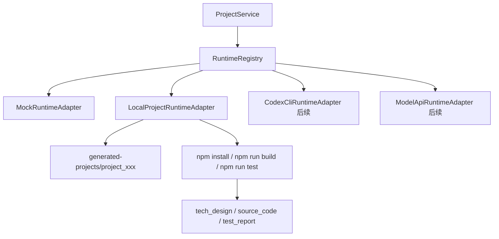

# 真实 Agent 执行器 MVP 设计

## 1. 目标

第二阶段要把第一阶段的 Mock Runtime 升级为可插拔的真实执行体系，让研发 Agent 能在隔离目录中生成一个完整 Web 项目，并把生成路径、构建结果、测试结果作为产物回写到工作台。

本阶段先打通一条真实交付链：

```text
需求 -> 计划 -> PRD -> 研发执行器生成项目 -> 本地验证 -> 测试报告 -> 审批/返工
```

## 2. 非目标

- 不在本阶段同时接入 Claude、DeepSeek、Hermes 的真实 API。
- 不在本阶段让模型自由执行任意 shell 命令。
- 不在本阶段做云端部署、账号体系、计费体系。
- 不在本阶段实现复杂文件浏览器，只展示生成项目摘要和路径。

## 3. 接入策略

采用分层 Runtime 架构：



第一步不直接依赖外部模型密钥，而是做一个 deterministic 的本地项目生成器。它会真实写入文件、真实运行构建/测试命令，证明系统已经具备“生成项目 + 验证 + 回写产物”的基础设施。

后续 Codex / Claude / DeepSeek 只需要替换“如何生成文件”的部分，不需要重写项目流程。

## 4. Runtime 类型

现有类型保留：

- `mock`
- `model_api`
- `codex_cli`
- `hermes`

本阶段使用：

- 默认 Agent 仍是 `mock`，保证旧流程稳定。
- 研发 Agent 可以通过环境变量切换为 `codex_cli`，先由 `LocalProjectRuntimeAdapter` 执行。

环境变量：

```text
AGENT_DEVELOPER_RUNTIME=codex_cli
GENERATED_PROJECTS_DIR=generated-projects
REAL_RUNTIME_VERIFY=true
```

说明：

- `AGENT_DEVELOPER_RUNTIME=codex_cli` 表示研发阶段使用真实项目生成器。
- `GENERATED_PROJECTS_DIR` 控制生成项目根目录。
- `REAL_RUNTIME_VERIFY=false` 时只生成文件，不运行 npm 验证，供低资源环境使用。

## 5. 生成项目范围

本阶段生成一个最小可运行 React/Vite 项目：

```text
generated-projects/
  project_<projectId>/
    package.json
    index.html
    src/
      main.tsx
      App.tsx
      styles.css
    README.md
```

生成项目能力：

- 根据用户需求写入 README。
- 生成一个可打开的前端页面。
- 包含 `npm run build`。
- 包含 `npm run test -- --passWithNoTests` 或等价 no-test 兜底。
- 生成完成后返回 `source_code` 产物，`filePath` 指向生成目录。

## 6. 阶段行为

### planning / prd / ui_optional / reviewing

继续走 Mock Runtime。

### developing

当研发 Agent 的 runtime 为 `codex_cli` 时：

1. 创建项目隔离目录。
2. 写入完整项目文件。
3. 运行验证命令。
4. 成功时生成：
   - `tech_design`
   - `source_code`
5. 失败时抛出运行错误，服务层把 StageTask 和 AgentRun 标记为 failed，并将项目置为 blocked。

### testing

本阶段测试 Agent 仍可使用 Mock Runtime，但测试报告需要能读取前一阶段的生成路径和验证日志摘要。

## 7. 错误处理

真实执行器失败必须有明确状态：

- AgentRun: `failed`
- StageTask: `failed`
- Project: `blocked`
- logs/error 保存失败原因

失败后前端能看到错误信息。下一阶段再提供“重新运行 blocked 阶段”的 UI。

## 8. API 与 UI

本阶段 API 不新增复杂端点，沿用现有项目快照接口。

前端增强：

- 产物卡片显示 `filePath`。
- 如果项目状态为 `blocked`，显示错误提示。
- `source_code` 产物应明确展示生成目录。

## 9. 安全边界

- 生成路径必须限制在 `GENERATED_PROJECTS_DIR` 下。
- 项目目录名只允许由内部 project id 派生。
- 不接受用户输入作为 shell 命令。
- 本阶段验证命令固定为 npm install/build/test。
- 不读取或展示 `.env`、token、私钥。

## 10. 验收标准

- 可以通过环境变量启用研发真实执行器。
- 创建项目并审批到 PRD 后，developing 阶段会生成真实项目目录。
- `source_code` 产物包含生成目录。
- 构建/测试日志进入 AgentRun logs。
- `npm run typecheck` 通过。
- `npm run test` 通过。
- `npm run build` 通过。

## 11. 后续演进

下一阶段在 `LocalProjectRuntimeAdapter` 的文件生成点替换为真实模型：

- Codex CLI：让 Codex 在隔离目录中生成/修改文件。
- Claude API：通过模型返回结构化文件补丁。
- DeepSeek API：通过模型返回结构化文件补丁。
- Hermes：作为多 Agent 编排和工具协议基础设施接入。
